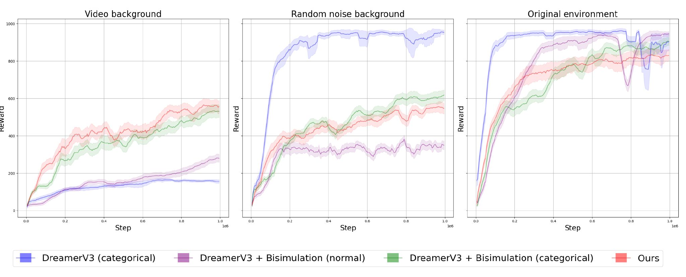
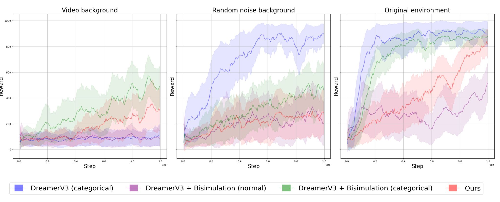
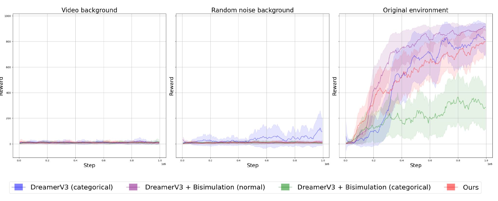

# Bisimulation-Based Representation Learning for DreamerV3

**Task-relevant world-model latents under visual distractors.**
Master's thesis project (HSE University, 2024) — [Artemy Moseychuk](https://www.linkedin.com/in/artemy-moseychuk-089a8a200/).

This repository modifies [DreamerV3](https://arxiv.org/abs/2301.04104) to learn observation representations that ignore task-irrelevant visual noise. The reconstruction objective of the world model is replaced with a bisimulation metric adapted to DreamerV3's categorical latent distributions (via Jensen–Shannon divergence), plus an action-aware extension of the metric. Evaluated on DeepMind Control tasks with distractor backgrounds (random video / Gaussian noise), the categorical bisimulation objective dramatically outperforms reconstruction-based DreamerV3 under correlated visual noise, while remaining competitive on clean environments.


*Walker Walk, 1M steps. Under video-background distractors (left), bisimulation objectives (green/red) learn task-relevant state where reconstruction-based DreamerV3 (blue) plateaus.*

## Motivation

World models like DreamerV3 learn latents by reconstructing observations. Reconstruction forces the latent to encode *everything* in the image — including backgrounds, textures, and other details irrelevant to the task — and can under-allocate capacity to small task-critical details. Under visual distractors this degrades control performance badly.

Bisimulation metrics offer a task-grounded alternative: two states are close if they yield similar rewards and similar transition distributions under the same policy — behavioral equivalence rather than visual similarity:

```
Bisim(sᵢ, sⱼ) = |rᵢᵖ − rⱼᵖ| + γ · D(Pᵖ(·|sᵢ), Pᵖ(·|sⱼ))
```

Prior work (e.g., DBC — Zhang et al., 2021) instantiates `D` as a 2-Wasserstein distance between Gaussian latents. DreamerV3, however, uses categorical latent distributions, where W₂ has no closed form.

## Contributions

**1. Distractor environments for DeepMind Control.**
Background pixels (task-irrelevant regions) are replaced per episode with either (a) a random video clip from Kinetics-400 (correlated, structured noise) or (b) i.i.d. Gaussian noise. This stress-tests whether the representation captures task-relevant state or memorizes appearance.

**2. Bisimulation for categorical latents.**
The distributional distance in the bisimulation target is replaced with Jensen–Shannon divergence, which is well-defined, symmetric, and bounded for categorical distributions:

```
D = JSD(P, Q) = ½ · KL(P ‖ M) + ½ · KL(Q ‖ M),   M = ½ (P + Q)
```

The world model is trained with this objective instead of the decoder / reconstruction loss (reconstruction-free DreamerV3).

**3. Action-aware bisimulation (act-Bisim).**
Standard bisimulation ignores how actions shape the next state, which can itself be task-relevant. We extend the metric so that similar states are required to respond similarly to arbitrary actions:

```
act-Bisim(f(aᵢ,zᵢ), f(aⱼ,zⱼ)) = |r(aᵢ,zᵢ) − r(aⱼ,zⱼ)| + γ · E_a [ ρ(f(a, z′ᵢ), f(a, z′ⱼ)) ]
```

where `f : A × Z → Z` is the latent dynamics model.

**A finding on estimating `E_a`:** the reported variant evaluates the expectation at a fixed probe action (the same action at every training step). Post-thesis experiments that resample the action uniformly at each step — the "correct" single-sample Monte Carlo estimate — destroy learning entirely: the regression target becomes non-stationary and too high-variance for the encoder to fit. A fixed probe action keeps the target geometry stationary and turns out to be what makes action-aware bisimulation trainable — averaging over 10 fixed actions did not recover performance either. See `bisim1`–`bisim4` in `WorldModel.loss` for all variants; `bisim3` is the one reported below.

## Results

Setup: DeepMind Control (Walker Walk, Reacher Easy, Reacher Hard) × three observation regimes (original / video background / Gaussian-noise background), 1M environment steps. Final policies evaluated over **150 episodes**; table reports mean ± s.e.

| Method \ Background | Original | Video | Noise |
|---|---|---|---|
| **Walker Walk** | | | |
| DreamerV3 (reconstruction) | **951.8 ± 4.0** | 155.3 ± 4.0 | **645.6 ± 10.0** |
| + Bisimulation (Gaussian, W₂) | **944.8 ± 5.0** | 306.2 ± 8.0 | 355.2 ± 11.0 |
| + Bisimulation (categorical, JSD) | 905.0 ± 8.0 | 518.8 ± 10.0 | **635.4 ± 11.0** |
| + act-Bisim (ours) | 846.8 ± 8.0 | **554.5 ± 11.0** | 551.8 ± 28.1 |
| **Reacher Easy** | | | |
| DreamerV3 (reconstruction) | 886.9 ± 35.0 | 90.5 ± 23.0 | **876.1 ± 39.0** |
| + Bisimulation (Gaussian, W₂) | 568.1 ± 53.0 | 90.3 ± 21.0 | 273.3 ± 63.0 |
| + Bisimulation (categorical, JSD) | **903.7 ± 16.0** | **583.3 ± 46.0** | 357.9 ± 63.0 |
| + act-Bisim (ours) | 177.1 ± 30.0 | 324.5 ± 57.0 | 241.8 ± 51.0 |
| **Reacher Hard** | | | |
| DreamerV3 (reconstruction) | 696.4 ± 58.0 | 9.9 ± 4.0 | 32.2 ± 19.0 |
| + Bisimulation (Gaussian, W₂) | **901.9 ± 17.0** | 8.3 ± 3.0 | 13.0 ± 4.0 |
| + Bisimulation (categorical, JSD) | 363.0 ± 56.0 | 8.4 ± 4.0 | 15.1 ± 3.0 |
| + act-Bisim (ours) | 801.8 ± 30.0 | **16.2 ± 3.0** | 12.7 ± 5.0 |

<details>
<summary><b>Training curves (click to expand)</b></summary>

**Reacher Easy**


**Reacher Hard**


Legend: *DreamerV3* — reconstruction baseline; *Bisimulation (normal)* — Gaussian latents + W₂; *Bisimulation (categorical)* — JSD objective (ours); *Ours* — action-aware bisimulation. Walker Walk curves are shown at the top of this page.
</details>

### Honest takeaways

- **Under correlated visual noise (video backgrounds), bisimulation-based objectives win big.** On Walker Walk the categorical/act variants reach 519–555 vs. 155 for reconstruction-based DreamerV3 (~3.5×); on Reacher Easy, 583 vs. 91 (~6×). This is exactly the regime the method targets: reconstruction wastes capacity on the distractor video, bisimulation ignores it.
- **On clean environments, reconstruction remains the stronger objective** (e.g., Walker Walk 952 vs. 847–905). Dropping the decoder trades some clean-environment performance for robustness.
- **Uncorrelated Gaussian noise is a different story:** reconstruction handles it surprisingly well (the noise averages out), and bisimulation brings little benefit there.
- **Action-aware bisimulation has task-dependent effects** — it wins on 2 of 3 correlated-noise environments but is unstable on Reacher Easy. Including action response in the metric helps when action consequences are task-discriminative, and hurts otherwise.
- **Variance in the metric target matters more than unbiasedness.** Estimating `E_a` with a fresh random action per step (unbiased, high variance) prevents learning altogether; a fixed probe action (biased, zero variance) trains fine and produces the results above. This mirrors the known sensitivity of bisimulation-style objectives to target stability.
- **Reacher Hard under distractors defeats all methods** at the 1M-step budget — the small target plus heavy noise makes task-relevant signal too sparse for every objective tested. An honest open problem.

## Usage

Built on the open-source [DreamerV3 reimplementation](https://github.com/danijar/dreamerv3) (JAX).

```bash
pip install -r requirements.txt

# Categorical bisimulation on Walker Walk with video-background distractors
# (backgrounds: any directory of .mp4 clips, e.g. from Kinetics-400)
python3 dreamerv3/train.py \
  --configs dmc_vision \
  --task dmc_walker_walk \
  --logdir ~/logdir/$(date "+%Y%m%d-%H%M%S") \
  --run.script train_eval \
  --run.steps 1000000 --run.eval_every 5000 --run.eval_eps 15 \
  --back_type 'video' \
  --back_train '/path/to/backgrounds/train/*.mp4' \
  --back_eval '/path/to/backgrounds/val/*.mp4' \
  --batch_size 16
```

Key flags:

- `--back_type` — distractor type: `video` (clips sampled per episode), `noise` (Gaussian), or none (clean environment). `--back_train` / `--back_eval` take glob patterns for the video clips (disjoint train/eval sets).
- `--enc_loss.impl` — representation objective: `bisim` (categorical JSD bisimulation, the default) or the action-aware variants in `WorldModel.loss` in [agent.py](dreamerv3/agent.py): **`bisim3` is the act-Bisim variant reported in the table** (fixed probe action, JSD transition distance); `bisim1` uses an L1 embedding distance instead; `bisim2` (action resampled each step) and `bisim4` (average over 10 fixed actions) did not train well and are kept as negative results.
- `--grad_heads reward,cont` — makes training reconstruction-free: the decoder still trains (for visualization) but its gradients do not flow into the encoder/RSSM. Default (`decoder,reward,cont`) keeps the reconstruction objective on.

General DreamerV3 usage tips (config blocks, debugging, logging, custom environments) are in the [upstream README](https://github.com/danijar/dreamerv3#instructions).

## Repository structure

Modules changed relative to upstream DreamerV3:

```
dreamerv3/agent.py                    # bisimulation losses in WorldModel.loss (all variants)
dreamerv3/nets.py                     # RSSM.get_dist extended for JSD between categorical latents
dreamerv3/embodied/core/background.py # background replacement: video / Gaussian noise (new)
dreamerv3/embodied/envs/dmc.py        # DMC wrapper with distractor backgrounds
dreamerv3/embodied/envs/dmc_xml/      # env XMLs with segmentable backgrounds (new)
dreamerv3/train.py, configs.yaml      # --back_type / --enc_loss flags, per-env seeding
```

Everything else is the unmodified [DreamerV3 codebase](https://github.com/danijar/dreamerv3); `scores/` contains the upstream benchmark data shipped with it.

## References & acknowledgements

- Hafner et al., *Mastering Diverse Domains through World Models* (DreamerV3), 2023
- Zhang et al., *Learning Invariant Representations for RL without Reconstruction* (DBC), 2021
- Castro, *Scalable Methods for Computing State Similarity in Deterministic MDPs*, 2019
- Deng et al., *DreamerPro*, 2022; Okada & Taniguchi, *DreamingV2*, 2022 — reconstruction-free world models via contrastive/prototypical objectives

This repository builds on the open-source DreamerV3 reimplementation by Danijar Hafner and is unrelated to Google DeepMind.

Thesis: *Representation Learning for Model-Based Reinforcement Learning*, HSE University (St. Petersburg School of Physics, Mathematics, and Computer Science), 2024. Advisor: O. A. Svidchenko. Full text and defense slides (in Russian): [assets/thesis.pdf](assets/thesis.pdf), [assets/slides.pdf](assets/slides.pdf).
